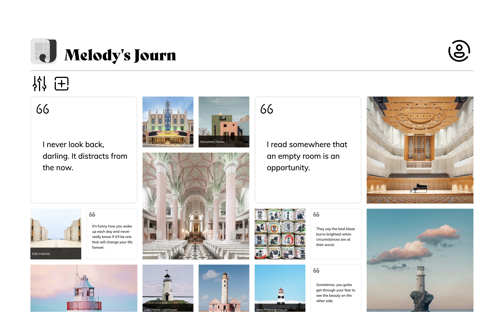

# Journ: A Digital Scrapbooking Web Application

**[Journ](https://journ.melodyho.dev)** is a digital scrapbooking web application that enables users to document moments using text, images, and videos. Users can attach custom tags to their entries, creating a highly dynamic scrapbook that can be filtered for different views.

**See demo here:** <https://journ.melodyho.dev>

## Making Of

**Technology:** CSS Modules, React, Next.js, Sequelize, MySQL, Amazon Simple Storage Service (S3)

### Authenticating Users

Sessions are authenticated with tokens containing user information, which are stored in cookies after verifying credentials. Passwords are hashed using [argon2](https://github.com/ranisalt/node-argon2), and tokens are encrypted using [@hapi/iron](https://github.com/hapijs/iron/tree/master).

### Uploading Multiple Images/Videos

Captions and/or tags for each entry in a batch upload are distinguished by assigning unique indexes to each file and attaching these indexes to their respective inputs.

### Optimizing Image Upload/Retrieval

Before uploading, images are resized and converted to WebP format to reduce file size while preserving sufficient quality.

### Storing Image/Video Files

Images and videos are stored in an Amazon S3 bucket. Each file is identified by the owning user's ID and the ID of the entry to which the file belongs.

### Filtering Entries

A SQL database is used to filter entries based on their creation date, entry type (text/image/video), and tags.

### Creating Feed Square Masonry Layout

A grid of squares is utilized for the feed layout, where each entry randomly occupies either 1 square or 4 (i.e., 2 x 2) squares, resulting in a square masonry appearance.

## Known Issues

- Entry dates are currently recorded in Coordinated Universal Time (UTC) regardless of the user's location. The implementation of time zones is included in the features roadmap.

## Features Roadmap

### Account Management

- **Account Deletion**: Allow users to delete their accounts.

### Entry Dates

- **Time Zones**: Implement user-specific time zones.

- **Displaying Entry Dates**: Display the date of an entry in the entry's detailed view.

- **Editing Entry Dates**: Allow users to edit entry dates.

### Feed View

- **Toggling Video Audio**: Allow users to toggle audio for videos in the feed.

- **Toggling Image/Video Captions**: Allow users to toggle captions for images and videos in the feed.

- **Customizing Feed Layout**: Allow users to adjust the randomly generated feed layout to suit their preferences.

### Sharing

- **Sharing Individual Entries**: Allow users to share a specific entry through a link.

- **Sharing Feed Layouts**: Allow users to share a specific feed layout through a link.

## Disclaimer

The link provided above directs to a demo. Please note, data may be deleted without prior notice to free up storage space on servers.

## Copyright

© 2024 Melody Ho. All rights reserved.

## Creator

**Melody Ho**  
<melodyho.contact@gmail.com>  
[Portfolio](https://www.melodyho.dev) | [GitHub](https://www.github.com/melody-ho) | [LinkedIn](https://www.linkedin.com/in/melodyho-dev)
